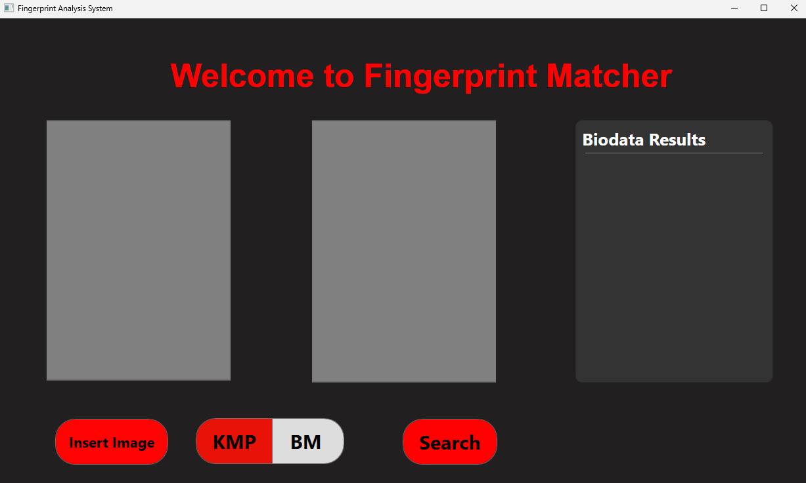
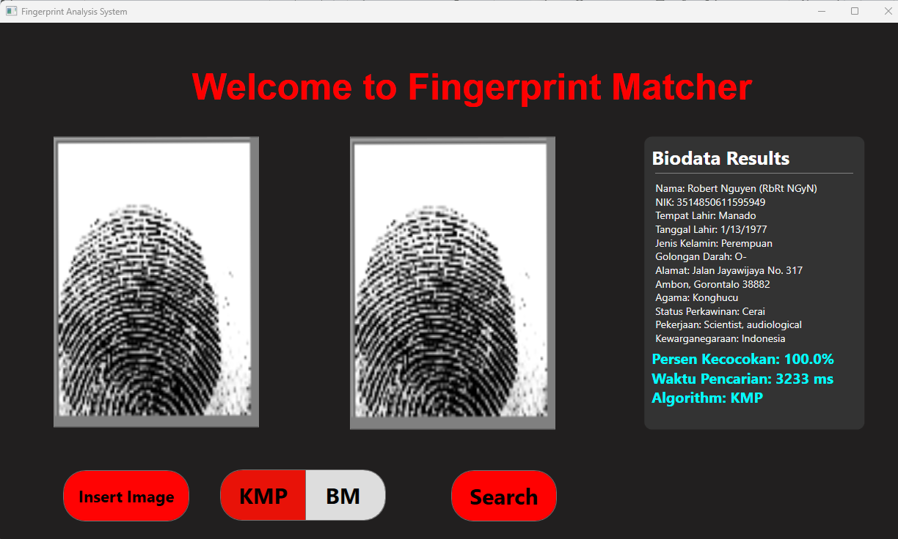

<h1 align="center">Tugas Besar 3 IF2211 Strategi Algoritma</h1>
<h1 align="center">Pencocokan Sidik Jari Menggunakan Algoritma KMP dan BM</h1>

## Identitas Pengembang Program
### **Kelompok 48: apaKek**
|   NIM    |                  Nama                  |
| :------: | :------------------------------------: |
| 13522055 |               Benardo                  |
| 13522081 |                Albert                  |
| 13522117 |            Mesach Harmasendro          |

## Deskripsi Program
Program ini merupakan aplikasi pencocokan sidik jari yang menggunakan algoritma Knuth-Morris-Pratt (KMP) dan Boyer-Moore (BM) untuk mencari kecocokan pola dalam data sidik jari. Jika tidak ditemukan kecocokan dengan KMP atau BM, program akan menggunakan algoritma Levenshtein Distance untuk mencari gambar dengan persentase kemiripan tertinggi.

### Algoritma yang Diimplementasikan

1. **Knuth-Morris-Pratt (KMP)**: KMP menghindari perbandingan ulang dengan menggunakan tabel border function untuk menentukan sejauh mana pola harus digeser jika terjadi ketidakcocokan. Ini memungkinkan KMP untuk melanjutkan pencarian tanpa harus memeriksa ulang karakter yang sudah diketahui cocok.

2. **Boyer-Moore (BM)**: BM bekerja dari kanan ke kiri dan menggunakan dua aturan utama: looking glass dan character jump. Dalam looking glass, pencocokan dimulai dari kanan ke kiri dari pola. Dalam character jump, BM dapat melakukan pelompatan jika terdapat ketidakcocokan, dengan menggunakan tabel last occurrence untuk menentukan lompatan dari indeks \(i\) dengan rumus \(i = i + m - \min(j, 1 + \text{last occurrence})\), di mana \(m\) adalah panjang pola, \(j\) adalah posisi karakter yang tidak cocok dalam pola, dan \(\text{last occurrence}\) adalah posisi terakhir karakter yang muncul dalam pola.

3. **Levenshtein Distance**: Algoritma ini mengukur perbedaan antara dua string dengan menghitung jumlah operasi penyuntingan (penghapusan, penyisipan, atau penggantian) yang diperlukan untuk mengubah satu string menjadi string lainnya. Hasil yang akan ditampilkan dibatasi untuk hasil dengan persentase kemiripan lebih dari 50%.

## Requirements Program
- Docker Desktop (https://www.docker.com/products/docker-desktop/)
- .NET SDK (https://dotnet.microsoft.com/download)

## Set Up dan Build Program

1. Silakan lakukan clone repositori ini dengan cara menjalankan perintah berikut pada terminal:
    ```
    git clone https://github.com/AlbertChoe/Tubes3_apaKek.git
    ```

2. Jalankan perintah berikut pada terminal untuk memasuki root directory program:
    ```
    cd ./Tubes3_apaKek
    ```

3. Pastikan Docker Desktop telah berjalan. Setelah berada pada root directory proyek ini, jalankan perintah berikut pada terminal:
    ```
    docker compose up
    ```
    **Catatan**: Pastikan port 3306 tidak terpakai karena akan dipakai untuk port MySQL pada Docker.

4. Masuk ke direktori `src` dan `Tubes3_apaKek`:
    ```
    cd src/Tubes3_apaKek
    ```

5. Jalankan program dengan perintah berikut:
    ```
    dotnet run
    ```
    Perintah ini akan membangun dan menjalankan aplikasi .NET yang berada di dalam direktori `Tubes3_apaKek`. Tunggu hingga proses selesai dan aplikasi siap digunakan. Program ini akan mulai berjalan dan Anda dapat mulai menggunakan fitur-fitur yang disediakan oleh program.

6. Alternatif Database
Selain menggunakan Docker, Anda juga bisa menggunakan database MySQL lokal yang ada pada sistem Anda. Agar database tersebut bisa terhubung dengan baik dengan aplikasi ini, pastikan untuk melakukan load `init.sql` file yang terdapat pada folder `init-sql` ke dalam database lokal Anda (Gunakan `mysqldump`). Pastikan juga database yang digunakan bisa diakses dengan username `root` dan password `1234` serta berjalan pada port 3306. Jika tidak ingin menggunakan data dari kami, Anda bisa membuat tabel sendiri dan menambahkan data sendiri. Namun, pastikan struktur tabel yang dibuat tetap sama dengan struktur tabel yang kami pakai. Setelah menambahkan data sendiri, data tersebut perlu dienkripsi agar bisa digunakan dengan baik oleh aplikasi kami. Untuk mengenkripsi database, jalankan file `enkripsiAllData.py` yang terdapat di root directory dari proyek kami ini.

## Dokumentasi Program



## Author
### **Kelompok 48: apaKek**
|   NIM    |                  Nama                  |
| :------: | :------------------------------------: |
| 13522055 |               Benardo                  |
| 13522081 |                Albert                  |
| 13522117 |            Mesach Harmasendro          |
